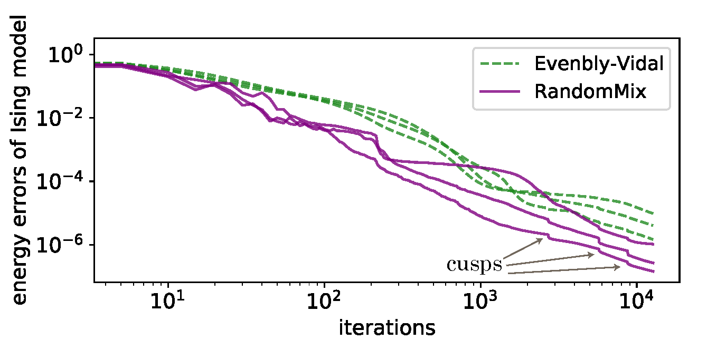

# Isometric Tensor Network
This project is used for the paper "Differentiable Programming of Isometric Tensor Network". ([arXiv:2110.03898](https://arxiv.org/abs/2110.03898))
## Main features:
* Auto-gradient based isometric tensor network construction (MERA and TNR).
* Several built-in spin models
* Multiple optimizers and retraction methods
* Compatible with the graduate lifting bond dimension trick
* Dynamically switching optimizers
* Computing scaling dimensions
## In future:
* More models, optimizers and retraction methods
* Layers for variation structures of MERA and TNR
* Quantum machine learning
* ...
## Dependencies
The code requires `Python` and `PyTorch`, with optional CUDA support.

# Gallery

## Computation process of MERA

  

## Computation process of TNR

  

## Comparing methods

  

The comparison of Evenbly-Vidal method and random mixed method in MERA. Cusps here indicate the position of lifting bond dimensions.

## Scaling dimensions

  

The scaling dimensions extracted from TNR. 
