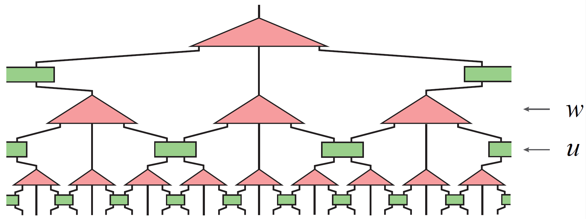
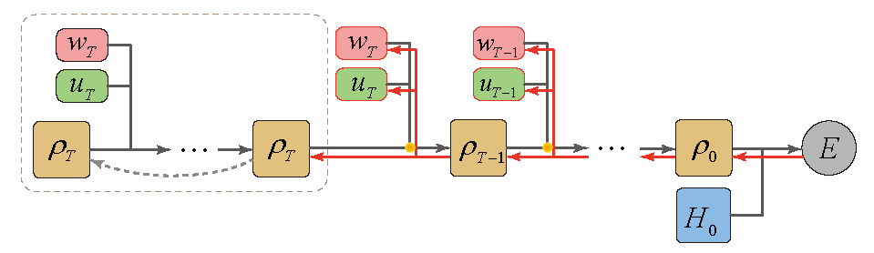
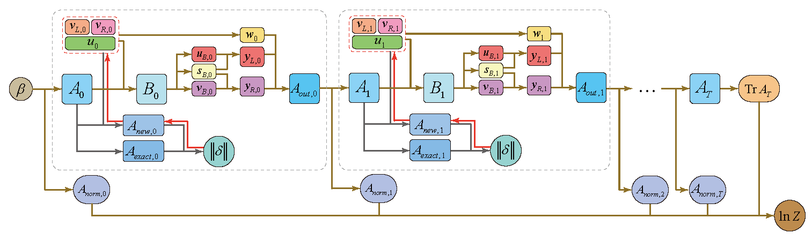
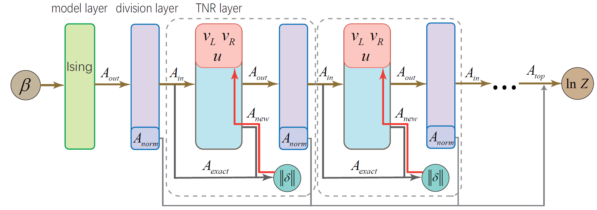
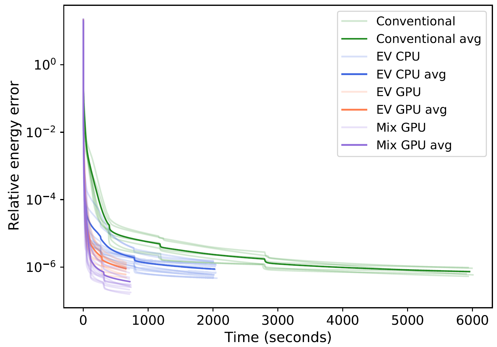
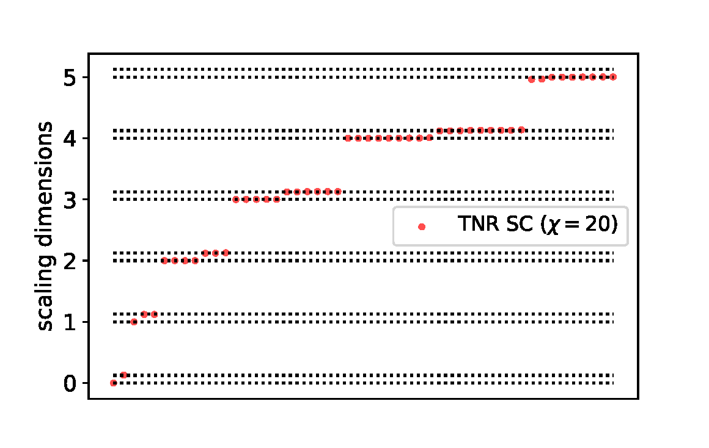

# Isometric Tensor Network
This project is used for the paper "Differentiable Programming of Isometric Tensor Network". ([arXiv:2110.03898](https://arxiv.org/abs/2110.03898))
## Main features:
* Auto-gradient based isometric tensor network construction (MERA and TNR).
* Several built-in spin models
* Multiple optimizers and retraction methods
* Compatible with the graduate lifting bond dimension trick
* Dynamically switching optimizers
* Computing scaling dimensions
## In future:
* More models, optimizers and retraction methods
* Layers for variation structures of MERA and TNR
* Quantum machine learning and quantum computing
* ...
## Dependencies
The code requires `Python` and `PyTorch`, with optional CUDA support.

# Gallery
## A Ternary MERA

  

## Computation process of MERA

  

## Computation process of TNR

  

## Network layers of TNR

  

## Efficiency comparing of these methods

  

Relative energy errors of Ising model as functions of time for conventional algorithm, differentiable programming with Evenbly-Vidal method in CPU, differentiable programming with Evenbly-Vidal method in GPU, and differentiable programming with random Mixing method in GPU.

## Scaling dimensions

  

The scaling dimensions extracted from TNR. 
